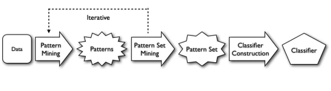

# thesis_beta

## Table of Contents

* [Getting Started](#getting-started)
  * [Prerequisites](#prerequisites)
     * [Software](#software)
     * [Python Libraries](#python-libraries)
  * [Setup](#setup)
* [Structure](#structure)
* [Usage](#usage)
    * [Dataset](#dataset)
	* [Fields](#fields)
    * [Baseline "main.py"](#baseline-mainpy)
        * [Pattern mining](#pattern-mining)
        * [Pattern set mining](#pattern-set-mining)
        * [Classifier construction](#classifier-construction)
* [Acknowledgements](#acknowledgements)


## Getting Started

Follow these instructions to set up suitable environment for running on your local machine for development and testing purposes.

### Prerequisites

Install the necessary dependencies before running the project:
<br/>
##### Software:
* [Docker](https://www.docker.com/)
* [Gradle (3.5.1)](https://gradle.org/releases/)  
* [PHP (7.2)](https://www.php.net/downloads.php)
* [Python (=>3.6)](https://www.python.org/)
* [PHPJoern](https://github.com/malteskoruppa/phpjoern)  
* [Joern](https://github.com/octopus-platform/joern)
<br/>
  
##### Python Libraries:
###### For ML classifier module:
* [Pandas (>=1.2.4)](https://pandas.pydata.org/)
* [scikit-learn (>=0.22.2)](https://scikit-learn.org/stable/)
<br/>
  
###### For CPG generate module:
* [pygraphviz (>=1.7.0)](http://pygraphviz.github.io)
<br/>
  
###### For database interaction module:
* [SQLAlchemy (>=1.4.11)](https://www.sqlalchemy.org/)
* [psycopg2 (>=2.8.6)](https://www.psycopg.org/)
<br/>
  
###### Other required libs:
* [lxml (>=4.5.0)](https://lxml.de)
* [configparser (>=5.0.2)](https://github.com/jaraco/configparser/)
<br/>
  
### Notes

---
These notes might save you some time:

* PHPJoern is compatible with PHP 7.2 so make sure you have the correct version of PHP and phpize working as default. 
* Joern version used in this project works best with Gradle version 3.5.1 and openjdk-8. (This is because LeftShift() 
  function used by Joern is deprecated from Gradle version 4.x onward).
* Follow the rest of the instruction steps on these tools's website to complete installation.


### Setup

---
#### 1) Install Prerequisites

#### 2) Configure the project
Verify you have the correct directory structure by matching with the ```"paths"``` in the configurations file ```configs.ini```.
Replace the username and password for interacting with database in ```docker-compose.yaml``` and ```database.ini```.

#### 3) Run docker-compose
Docker-compose will set up the suitable environment and connection to postgreSQL database and Neo4j database.

##Usage

### Dataset

---
The dataset used is the [WIRECAML DATASET](https://www.dropbox.com/s/i6e4kv64eudoq6m/wirecaml-data.tar.gz?dl=1) released 
by the authors of [this paper](https://dl.acm.org/doi/10.1145/3230833.3230856) which includes data from 
The National Vulnerability Database (NVD) and NIST Software Assurance Metrics And Tool Evaluation (SAMATE).
The dataset contain safe and unsafe samples of 2 commons web app vulnerabilities: XSS and SQLi
The dataset is handled with files in Dataset module.
<br/>
<br/>
The above dataset will be split into 3 subsets with ratio 70%, 10% and 20% to use as training set,
validation set and testing set respectively.
<br/>
<br/>

### Baseline "main.py"

---
The script ```main.py``` contains functions to parse arguments from the command and run corresponding tasks.
The tasks are divide according to three main steps: pattern mining, pattern set mining, 
and classifier construction and some other sub-steps.



#### Data preprocessing
This is a sub-step to process data retrieve from source code and transform into CPG graphs
form in which we will use to mine patterns in the next step. <br/>
</br>
* Data from NVD dataset is handled by class and functions in ```Dataset/dataset_nvd.py```.
In addition to source code which will be converted to CPG later, we will need information about
the type of vulnerability as well as the lines of vulnerable code.
The NVD database provides us with source code before and after being patched, we will diff the two
versions to get the vulnerable line number that have been remove when patched.</br>
</br>
* Data from Samate dataset is   


#### Pattern mining
This is the first task where the dataset is filtered (optionally) and augmented with a column that 
contains the respective Code Property Graph (CPG).
<br/>
<br/>
Functions in the dataset are written to files into a target directory which Joern is queried with for creating the CPG. 
After the CPG creation, Joern is queried with the script "graph-for-funcs.sc" which creates the graphs from the CPG.
Those are returned in JSON format, containing all the functions with the respective AST, CFG and PDG graphs.

#### Pattern set mining
This task transforms the source code functions into tokens which are used to generate and train the word2vec model 
for the initial embeddings. The nodes embeddings are done as explained in the paper, for now just for the AST: 


Execute with:
``` console
$ python main.py -e

```

#### Classifier construction

## Acknowledgments
Guidance and ideas for some parts from:

* [Transformer for Software Vulnerability Detection](https://github.com/hazimhanif/svd-transformer)
* [SySeVR: A Framework for Using Deep Learning to Detect Vulnerabilities](https://github.com/SySeVR/SySeVR)
* [VulDeePecker algorithm implemented in Python](https://github.com/johnb110/VDPython)
